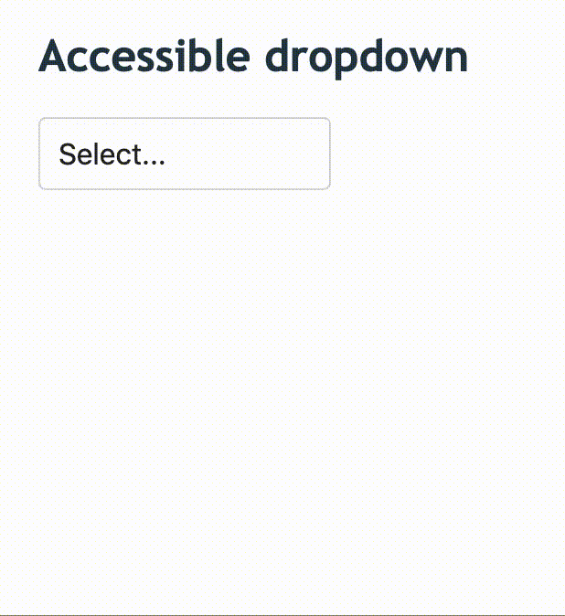

# A keyboard accessible dropdown in elm

An example of a dropdown written in elm, supported features:

- full keyboard accessibility
  - focusable - supports tabbing into,
  - open on Enter or Space key,
  - focus options when navigating with arrow keys ⬆️ and ⬇️,
  - select currently focused option with Enter/Space,
  - close with Escape or on focus out,
- close on click outside,
- scroll into the selected option on open,
- native Elm with no JS ports 😎

## Demo

Demo of the fabulous dropdown:

<p>

</p>

---

This project is bootstrapped with [Create Elm App](https://github.com/halfzebra/create-elm-app).

## Run the examples

```sh
elm-app start
```

Runs the app in the development mode.
Open [http://localhost:3000](http://localhost:3000) to view it in the browser.

The page will reload if you make edits.
You will also see any lint errors in the console.
